# Happy Home Internal Design & Services Company

The website caters to individuals who are seeking professional design services, value quality and attention to detail, and desire a satisfying and collaborative design experience for their homes or interior spaces.

Visit the deployed website [here](https://anwardawoud.github.io/FitoutdesigncompanyPP1/)

## Mockup
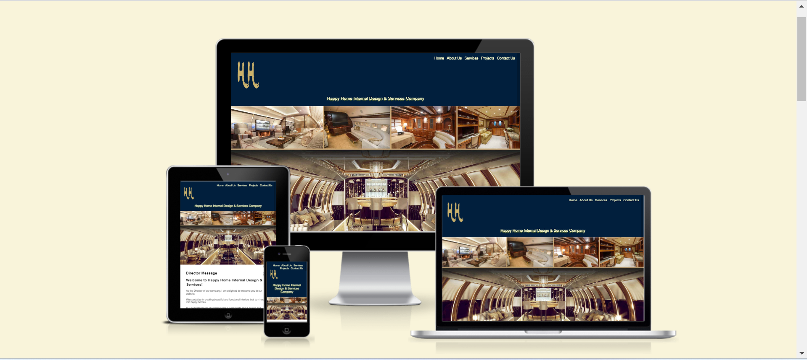

## Table of contents

1. [User Experience (UX)](#user-experience-ux)
    * [Project Goals](#project-goals)
    * [Color Scheme](#color-scheme)
    * [Typography](#typography)
    * [Wireframes](#Wireframes)
    * [Users stories](#users-stories)
 2. [Features](#features)
    * [General](#general)
    * [Home page](#home-page)
    * [Aboutus page](#aboutus-page)
    * [Services page](#services-page)
    * [Projects page](#projects-page)
    * [Contactus page](#contactus-page)
3. [Technologies Used](#technologies-used)
    * [Languages Used](#languages-used)
    * [Frameworks, Libraries and Programs Used](#frameworks-libraries-and-programs-used)
4. [Testing](#testing)
    * [Code Validation](#code-validation)
    * [Accessibility](#accessibility)
    * [Tools Testing](#tools-testing)
    * [Testing stories](#testing-stories)
    * [Manual Testing](#manual-testing)
    * [Unfixed bugs](#unfixed-bugs)
5. [Finished Product](#finished-product)
6. [Deployment](#deployment)
    * [GitHub-deploy](#github-deploy)
7. [Credits](#credits)
    * [Content](#content)
    * [Media](#media)
    * [Code](#code)
8. [Acknowledgements](#acknowledgements)

## User experience

### Project Goals

* Creating Beautiful and Functional Spaces: The company aims to transform homes and interior spaces into aesthetically pleasing and functional environments.

* Exceptional Service: Providing outstanding customer service is a priority, ensuring clients receive a professional and attentive experience throughout the design process.

* Collaboration and Vision Realization: Working closely with clients to understand their vision and translate it into tangible design concepts, from inception to execution.

* Diverse Range of Services: Offering a wide range of services, including interior design, remodeling, furniture selection, and more, to cater to various client needs.

* Attention to Quality and Detail: Emphasizing the use of high-quality materials and partnering with reliable suppliers to ensure the durability and strength of their designs.

* Client Satisfaction: Placing client satisfaction at the forefront, the company strives to fulfill the client's dream of an ideal home.

### Color Reference

| Color             | Hex                                                                |
| ----------------- | ------------------------------------------------------------------ |
| Header Text Color |  #ffffcc (Light Yellow)|
| Header Background Color | #011f3d (Dark Blue)|
| Footer Text Color |  #ffffcc (Light Yellow)|
| Footer Background Color | #011f3d (Dark Blue)|

* These color choices result in a contrasting combination, with light yellow text on a dark blue background for both the header and footer sections of the website. This combination can create a visually appealing and impactful design.

### Typography

The font-family 'Arial', sans-serif is a commonly used font combination for web typography. It specifies that the preferred font for the text should be Arial, a sans-serif font.

Using a sans-serif font like Arial can provide a clean and modern look to the typography on my website. It is a widely available font that is easy to read on various screen sizes and devices.

By specifying 'sans-serif' as a fallback option, we ensure that if Arial is not available on a user's device, the browser will automatically select a similar sans-serif font as a backup.

Overall, the font-family 'Arial', sans-serif is a reliable choice for web typography, offering readability and compatibility across different platforms

### Wireframes

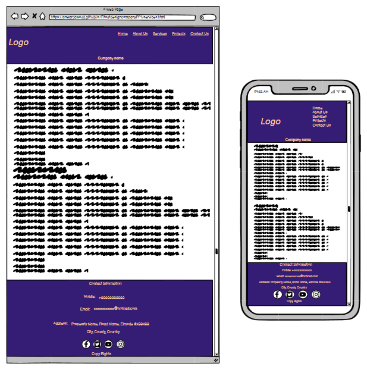

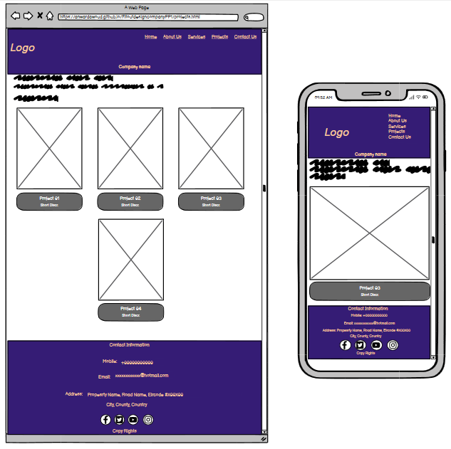

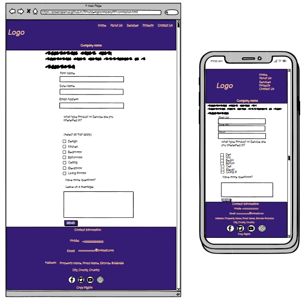

### Users stories

## User Story

As a potential customer of Happy Home Internal Design & Services, I want to be able to easily browse and explore the services they offer and find inspiration for my own interior design projects.

### Acceptance Criteria

- When I visit the Happy Home website, I expect to be greeted with an appealing and user-friendly interface.
- I should be able to navigate through the different pages of the website seamlessly, such as the Home, About Us, Services, Projects, and Contact Us pages.
- On the Services page, I want to see a clear and concise introduction to Happy Home's mission and services.
- The Services page should provide detailed information about the various interior design services offered, such as interior decoration, remodeling, furniture selection, and more.
- The Projects page should showcase a gallery of stunning design projects completed by Happy Home, giving me inspiration and an idea of their design capabilities.
- When I click on a specific project, I should be able to view image of that project.
- The Contact Us page should include a contact form where I can easily submit my inquiries or request a consultation.
- I expect the website to be responsive and optimized for different devices, including desktops, tablets, and mobile phones.

[back to top](#happy-home-internal-design--services-company)

## Features

### General

* Responsive design for all device sizes.

* Respect the color scheme and display the information in a clear, concise and 
understandable way for the user.

* **Header** 

    - The header contains the web logo, a simple desing with the name of the website.
    - The navigation bar with links in that, turns
     the text with underline when hover, to enhance user experience.
    - All pages has same navigation bar, 

* **Footer**

    - The footer have the popular social networks, facebook, instagram, youtube and twitter, which open in a new window.

### Home page

* The Home page consists of 2 sections:

    - Hero image 

    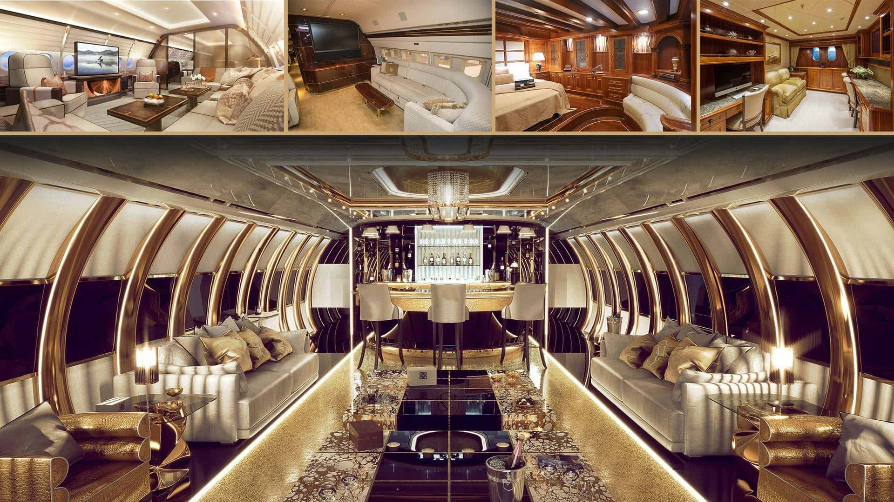

    - Director's Message to the users 

### Aboutus page

- Team's message to the users

### Services page
* Our Services:
    - Design and Concept Development.

    - Project Management.

    - Interior Fit Out.

    - Joinery and Carpentry.

    - Electrical and Plumbing Works

### Projects page
* Gallery of all completed Projects for the user easy reference.

### Contactus page
* Form to submit the users enqueries and to allow them be in touch with company team in detail.

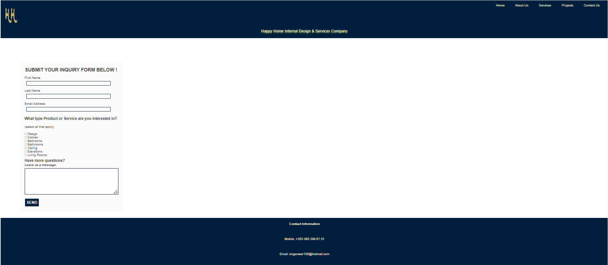

* The test of form submition will be shown as following:- 

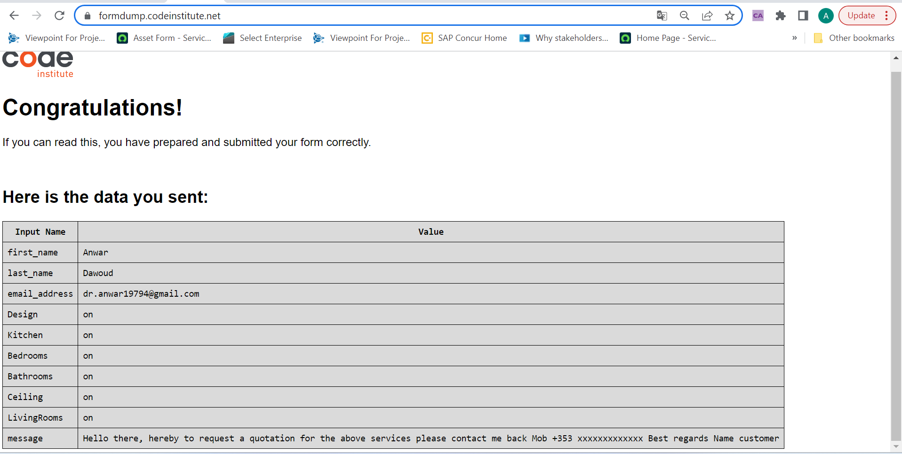

[back to top](#happy-home-internal-design--services-company)

## Technologies Used

### Languages Used

* [HTML5](https://en.wikipedia.org/wiki/HTML5)
* [CSS3](https://en.wikipedia.org/wiki/CSS)

### Frameworks, Libraries and Programs Used

*  [balsamiq](https://balsamiq.cloud/)

     - Balsamiq was used for creating wireframes

* [CA](https://app.codeanywhere.com/)
     - Codeanywhere was used for writing code, committing, and then pushing to GitHub.

* [GitHub](https://github.com/)
     - GitHub was used to store the project after pushing.

* [Am I Responsive?](http://ami.responsivedesign.is/#)
    - Am I Responsive was used to generate mockup image. 

* [Chrome DevTools](https://developer.chrome.com/docs/devtools/)
    - Chrome DevTools was used during development process for code review and to test responsiveness.

* [W3C Markup Validator](https://validator.w3.org/)
    - W3C Markup Validator was used to validate the HTML code.

* [W3C CSS Validator](https://jigsaw.w3.org/css-validator/)
    - W3C CSS Validator was used to validate the CSS code.

[Back to top ](#happy-home-internal-design--services-company)

## Testing

### Code Validation

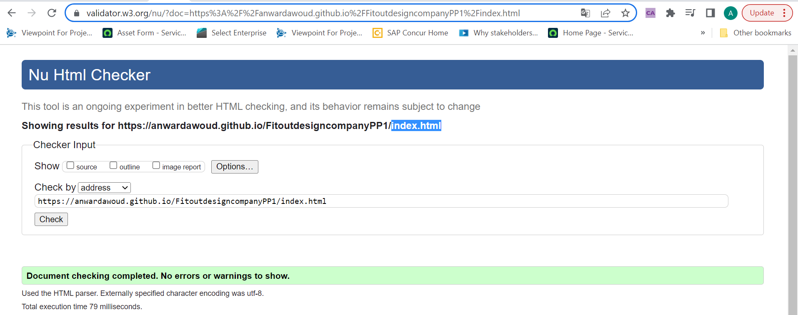

*  No errors or warnings to show.

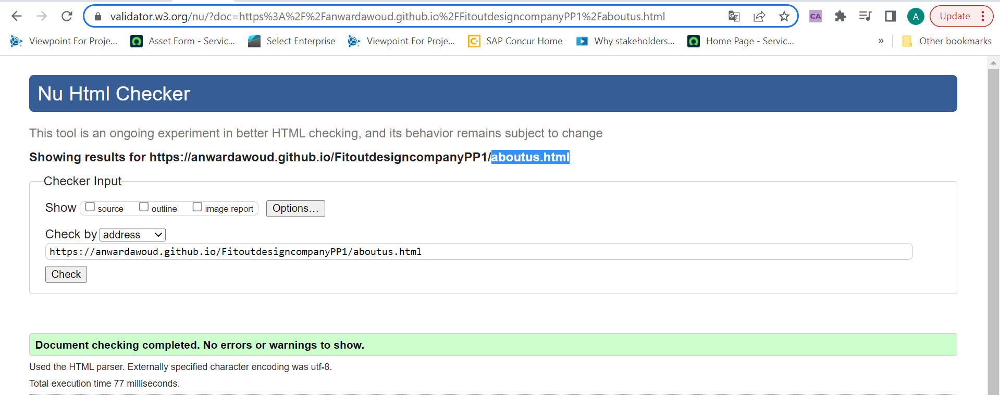

* No errors or warnings to show.

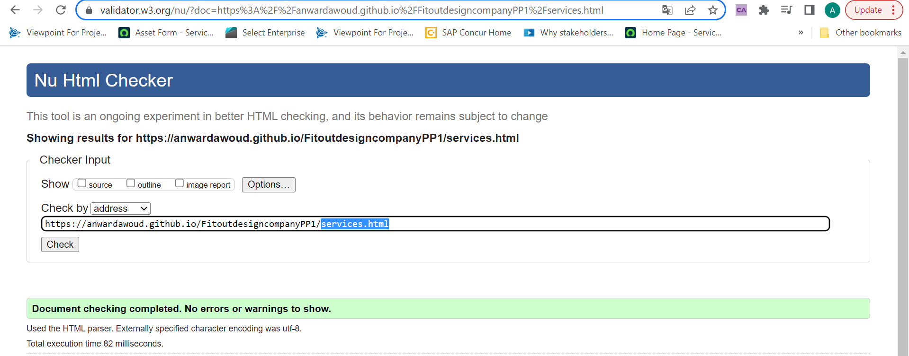

* No errors or warnings to show.

* No errors or warnings to show.

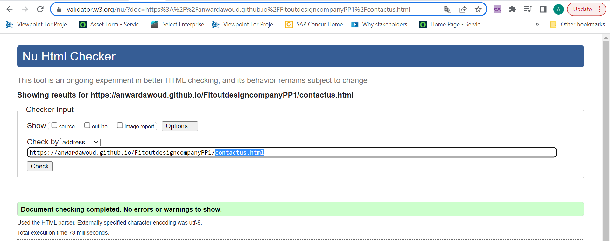

* No errors or warnings to show.

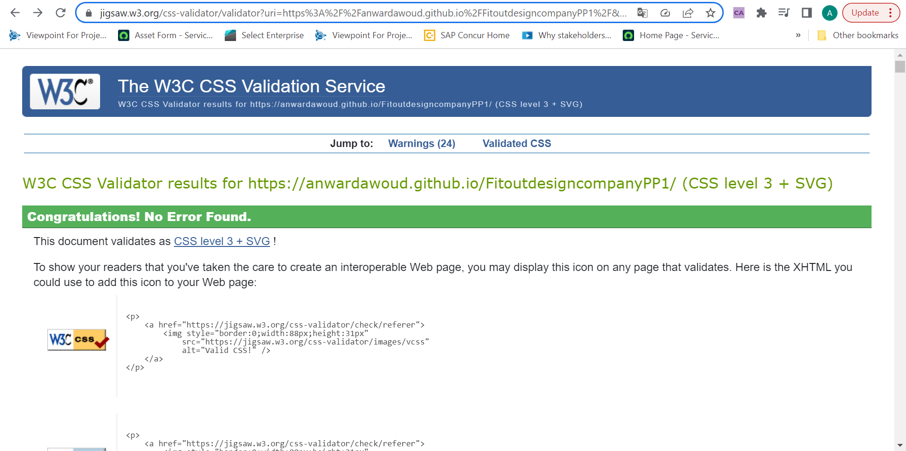

* No errors Found.

### Accesibility

* Lighthouse Devtool from Google Chrome used for testing.
* Lighthouse testing:

 + Home page:
    - Desktop version:

        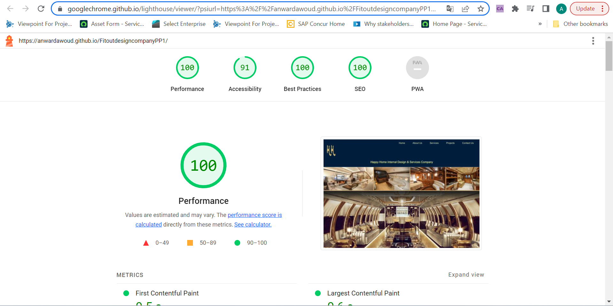

    - Mobile version:

        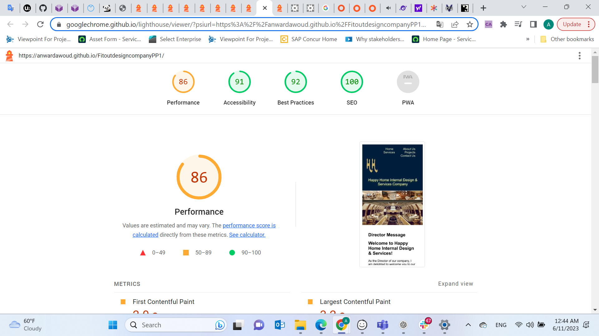

+ Aboutus page:
    - Desktop version:
        
        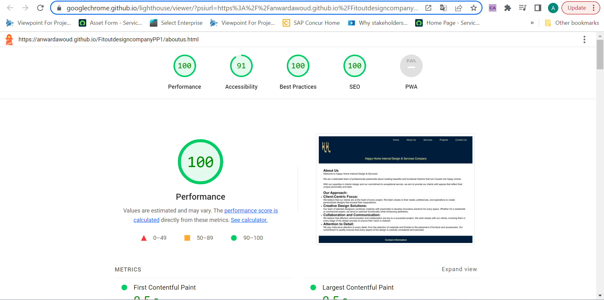
    
    - Mobile version:
        
        

+ Services page:
    - Desktop version:

        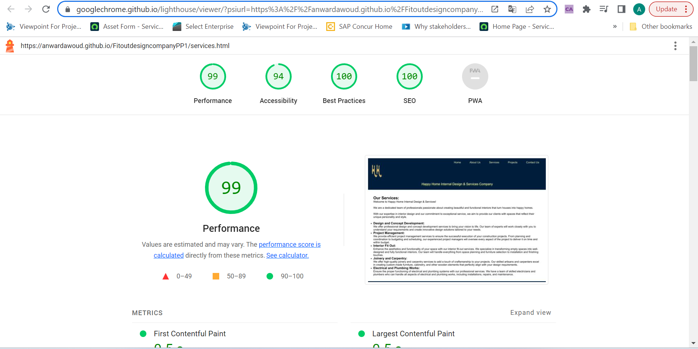

    - Mobile version:

        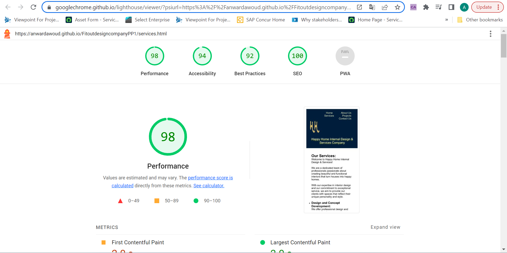

+ Projects page:
    - Desktop version:

        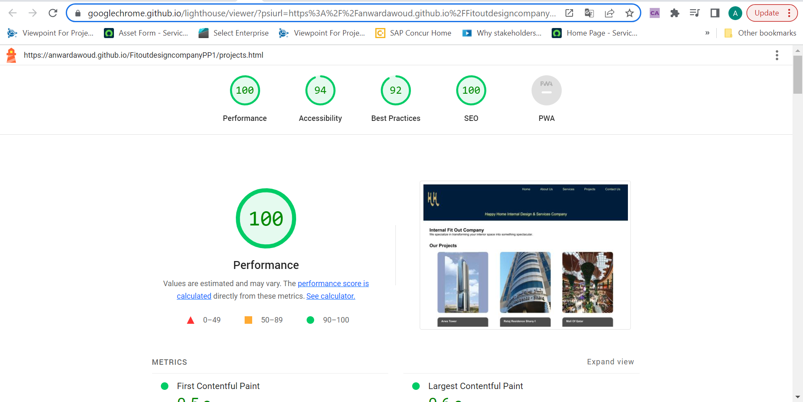

    - Mobile version:

        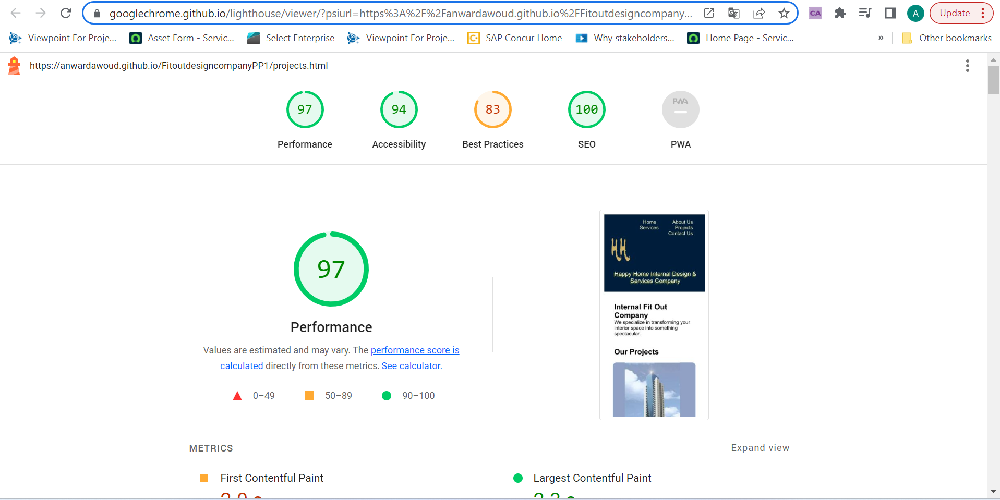

+ Contactus page:
    - Desktop version:

        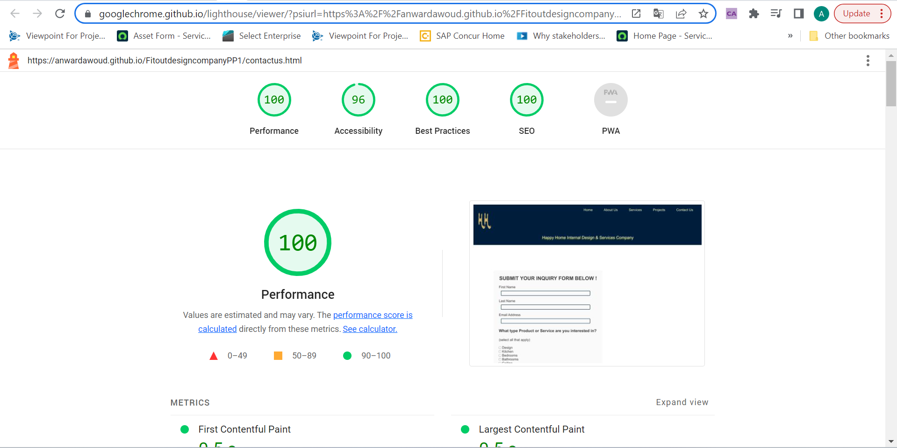

    - Mobile version:

        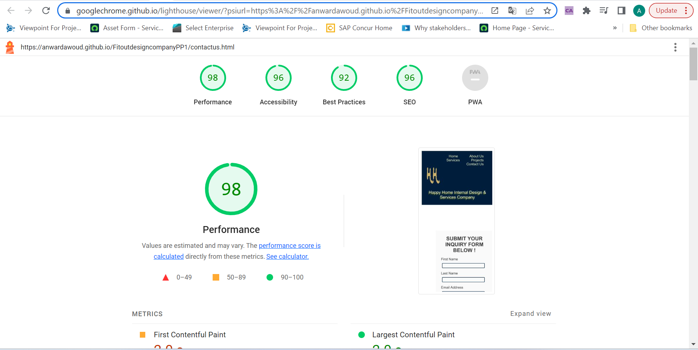

### Tools testing
    
* [Chrome DevTools](https://developer.chrome.com/docs/devtools/)

    - Chrome DevTools was used to explore and modify HTML and CSS during development.
* Responsiveness
    
    - [Am I Responsive?](http://ami.responsivedesign.is/#) was used to check the website responsiveness on different screen size.

### Testing stories

* User Story: As a user, I want to be greeted with an appealing and user-friendly interface when I visit the Happy Home website.

   - Test: Open the Happy Home website.
        - Expected Result: **Complied**

* User Story: As a user, I want to navigate through the different pages of the website seamlessly.

    - Test: Click on the navigation links for the Home, About Us, Services, Projects, and Contact Us pages.
        - Expected Result: **Complied**

* User Story: As a user, I expect to see a clear and concise introduction to Happy Home's mission and services on the Home page.

    - Test: Go to the Services page and read the content.
        - Expected Result: **Complied**

* User Story: As a user, I want the Services page to provide detailed information about the various interior design services offered by Happy Home.

    - Test: Go to the Services page and read the content. The Services page should provide detailed information about the various interior design services offered by Happy Home, such as interior decoration, remodeling, furniture selection, and more.
    
        - Expected Result: **Complied**

* User Story: As a user, I expect the Projects page to showcase a gallery of stunning design projects completed by Happy Home.

    - Test: Go to the Projects page and view the gallery. The Projects page should showcase a gallery of stunning design projects completed by Happy Home, providing inspiration and showcasing their design capabilities.
        - Expected Result: **Complied**

* User Story: As a user, I should be able to view more details and images of a specific project when I click on it.

    - Test: Click on a specific project in the gallery. The website should display images of the selected project.
        - Expected Result: **Complied**

* User Story: As a user, I want the Contact Us page to include a contact form for submitting inquiries or requesting a consultation.

    - Test: Go to the Contact Us page and locate the contact form. The Contact Us page should include a contact form that allows users to easily submit their inquiries or request a consultation.
        - Expected Result: **Complied**

* User Story: As a user, I expect the website to be responsive and optimized for different devices.

    - Test: Open the website on different devices, including desktops, tablets, and mobile phones.
        - Expected Result: **Complied**

### Manual testing

* Common element testing

    - All Pages
        
        - **Header**

            - Clicking on the main logo will bring the user back to the home page.

        - **Navigation Bar**

            - Hovering on the different navigation bar's links will trigger hover effect, underlining the link for the user.

            - Clicking on the navigation bar's links will bring the user to the specified page.
        
        - **Footer**
        
            - Clicking on the social media links will open the specific website on a new tab.
    
    - Home page:

        - This page only has interactions in the Header, navigation bar and footer that has been tested already.
    
    - Aboutus page:

        - This page only has interactions in the Header, navigation bar and footer that has been tested already.

    - Services page:

        - This page only has interactions in the Header, navigation bar and footer that has been tested already.
    
    - Aboutus page:

        - This page has interactions in the Header, navigation bar and footer that has been tested already.

        - Furthermore the Galleries can be open in different tap to the original size for better experience
    
    - Contactus page:

        - Interaction form prior to submit.

        - Hovering over submit button triggers hover effect.
       
### Unfixed bugs

* No unfixed bugs remaining in the website.

[Back to top ](#happy-home-internal-design--services-company)

## Finished product

Page | Desktop version | Mobile version
--- | --- | ---
Home page | 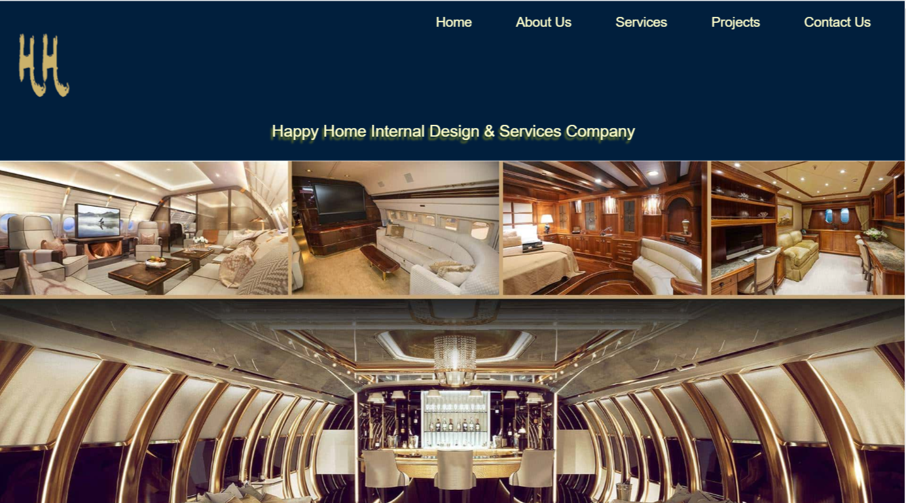 | 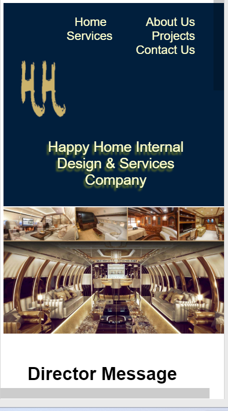
Aboutus page | 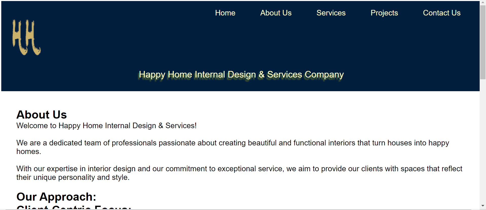 | 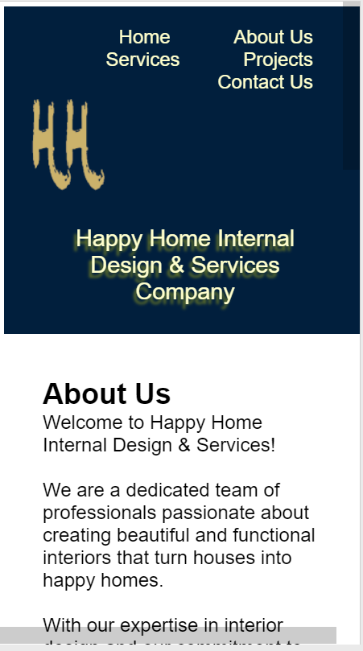
Services page | 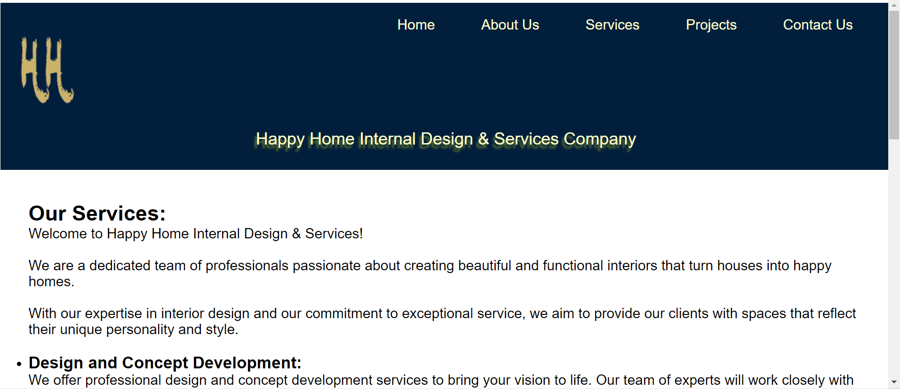 | 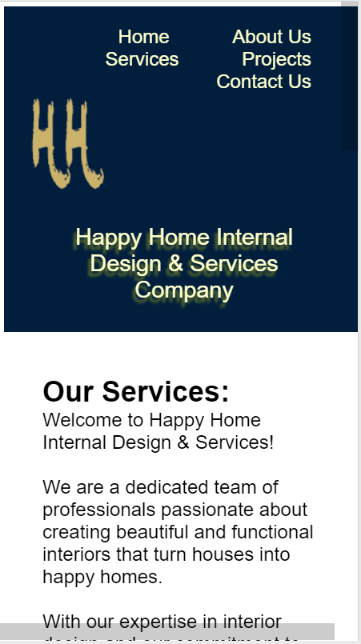
Projects page | 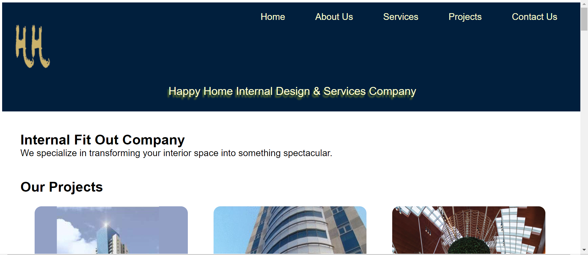 | 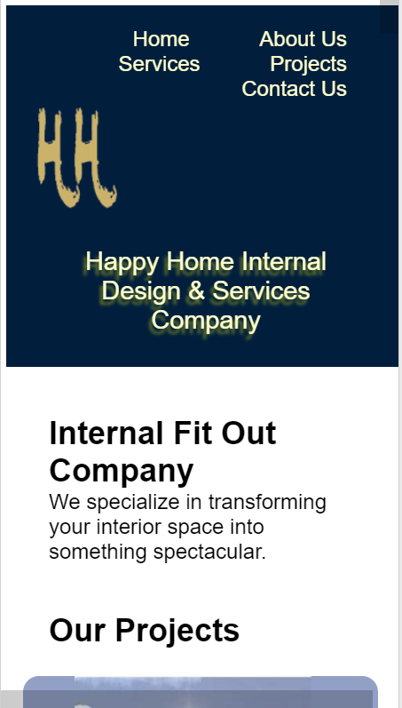
Contactus page | 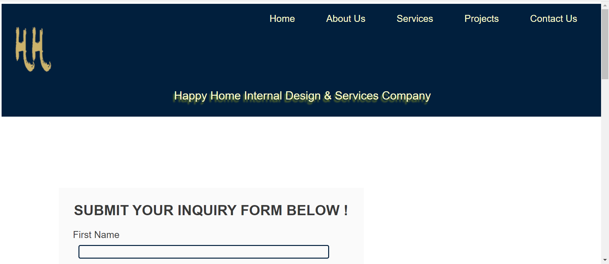 | 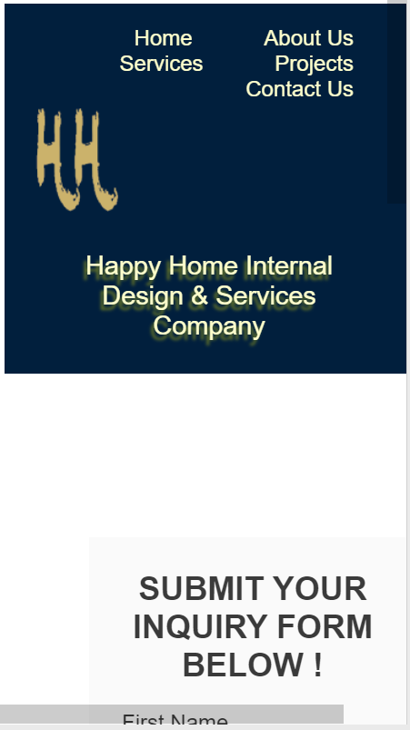

[Back to top ](#happy-home-internal-design--services-company)

## Deployment

### GitHub-deploy

* This are the steps I followed to deploy my project from its GitHub repository:

1. Open [GitHub Repository](https://github.com/) login and find the project repository.
2. At the top of the repository on the right corner click on settings button.
3. Go to Pages section inside settings.
4. Go to Branch tag and find a dropdown menu where you can choose between none or main.
5. Select main, after a short waiting GitHub will generate your website link.

[Back to top ](#happy-home-internal-design--services-company)

## Credits

### Content

* All content was originally created and written by Anwar Dawoud, the developer.

### Media

* Main image, which called Hero picture

* All photos related to projects section is a real completed projects by Anwar Dawoud in the State of Qatar

### Code

* [W3Schools](https://www.w3schools.com/) were visited for better understanding of coding elements syntax.

[Back to top ](#happy-home-internal-design--services-company)

## Acknowledgements

* Code Institute and slack community for all the support in this project

* Jack, my mentor for his kind help and his time.

* My Great Family that had been helping with giveing more time for the project.

[Back to top ](#happy-home-internal-design--services-company)

